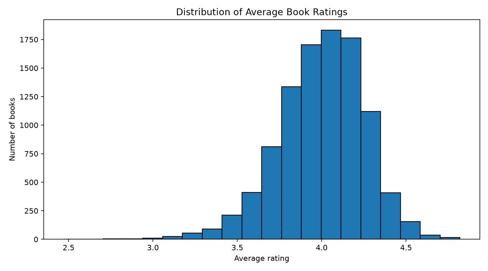
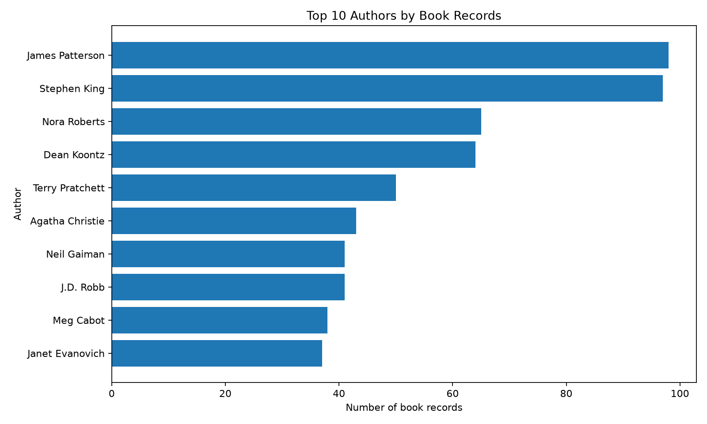
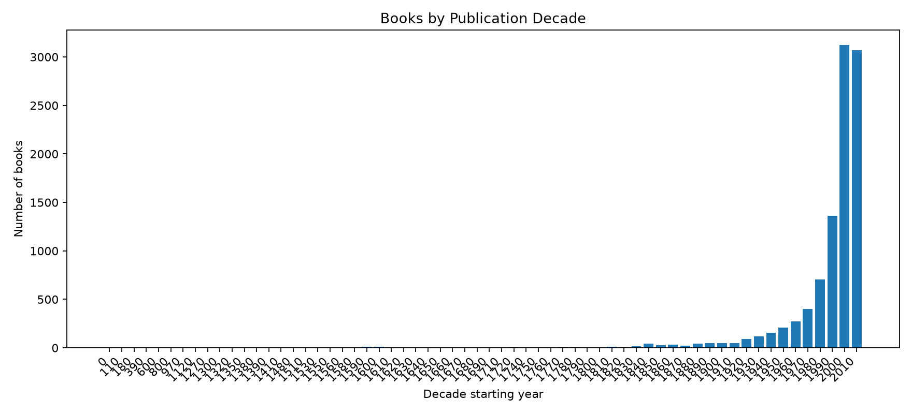
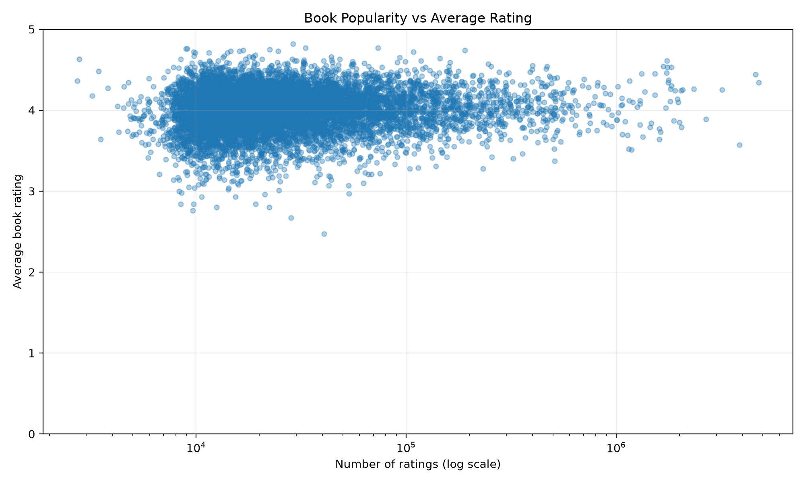

# The Data Behind Books

### A Statistical Exploration of Books, Authors, and Reader Ratings

**Created by:** Babaldeep Sharma  
**Academic context:** IIT Madras BS Degree Programme  
**Project area:** Statistics and Data Analysis

---

## About the Project

The Data Behind Books is a statistics project exploring patterns in a selected collection of 10,000 books. It examines reader ratings, author representation, publication years, and summary statistics to understand what the data can tell us about books.

The project uses data obtained from Goodreads and organises it into tables and summaries for statistical exploration.

The goal is not just to present numbers, but to interpret them carefully, communicate findings clearly, and recognise the limitations of a dataset.

## Research Questions

This project explores the following questions:

- What is the typical rating of a book in the dataset?
- How are ratings distributed across one to five stars?
- Which authors appear most frequently in the selected collection?
- What publication years are represented?
- What can descriptive statistics tell us, and what can they not tell us?

## Dataset Overview

The main dataset contains 10,000 book records.

| File | Description |
|---|---|
| `data/books.csv` | Main book dataset used for exploration |
| `data/authorcounts.csv` | Prepared author book-count summary |
| `data/author_split.csv` | Author data separated for analysis |
| `data/conclusions.csv` | Prepared findings and summary information |
| `data/charts.csv` | Empty in the original files; not used as a data source |

The files above describe the current working dataset. Column names, missing values, and record counts should be checked in the CSV files before reusing the data.

## Statistical Findings

The prepared analysis contains the following summary statistics:

| Measure | Value |
|---|---:|
| Number of books | 10,000 |
| Mean rating | 4.0022 |
| Median rating | 4.02 |
| First quartile (Q1) | 3.85 |
| Third quartile (Q3) | 4.18 |
| Interquartile range (IQR) | 0.33 |
| Standard deviation | 0.2544 |

The interquartile range is the difference between the third and first quartiles:

`IQR = Q3 - Q1 = 4.18 - 3.85 = 0.33`

These statistics suggest that ratings in this collection are generally high and that the middle half of the recorded book ratings lies within a relatively narrow range.

### Authors with the Highest Book Counts

The prepared author-count summary lists the following authors most frequently:

| Author | Book count |
|---|---:|
| James Patterson | 98 |
| Stephen King | 97 |
| Nora Roberts | 65 |
| Dean Koontz | 64 |
| Terry Pratchett | 50 |
| Agatha Christie | 43 |
| J.D. Robb | 41 |
| Neil Gaiman | 41 |
| Meg Cabot | 38 |
| Janet Evanovich | 37 |

These counts describe the dataset used in this project. They do not establish which authors have written the most books overall.

### Rating Distribution

The prepared rating summary reports:

| Rating | Share | Number of ratings |
|---|---:|---:|
| 1 star | 2% | 13,450,406 |
| 2 stars | 5% | 30,997,156 |
| 3 stars | 19% | 114,758,938 |
| 4 stars | 33% | 199,656,966 |
| 5 stars | 40% | 237,898,056 |
| **Total** | **99%*** | **596,873,216** |

\*The displayed percentages total 99% because of rounding in the prepared summary.

Four- and five-star ratings account for the largest shares in this summary. These are counts of ratings, not necessarily counts of individual books.

### Publication Years

The dataset spans publication years from 1750 to 2017, according to the prepared project summary. The number of records from each year should be checked against the original publication-year column before drawing further conclusions.

## Files and Project Structure

```text
the-data-behind-books/
├── data/
│   ├── books.csv
│   ├── authorcounts.csv
│   ├── author_split.csv
│   ├── charts.csv
│   └── conclusions.csv
├── charts/
├── analysis/
│   └── chart.py
├── .gitignore
└── README.md
```

The `charts/` directory is intended for generated visualisations. The `analysis/` directory contains the Python chart script.

## How to Download the Project

### Option 1: Download from GitHub

Once this repository is published:

1. Open the GitHub repository page.
2. Click **Code**.
3. Select **Download ZIP**.
4. Extract the ZIP file on your computer.

This downloads the files that have actually been committed to the repository.

### Option 2: Download an Individual File

Open a CSV file in the repository and click **Raw** to view or download its contents. For a direct-download URL, use the file's GitHub raw URL.

For example, after replacing `YOUR-USERNAME` with the repository owner's GitHub username:

`https://raw.githubusercontent.com/YOUR-USERNAME/the-data-behind-books/main/data/authorcounts.csv`

### Option 3: Clone the Repository

If Git is installed, run:

```bash
git clone https://github.com/YOUR-USERNAME/the-data-behind-books.git
cd the-data-behind-books
```

Replace `YOUR-USERNAME` with the correct GitHub username.

## Reproducing the Charts

Requirements: Python 3 and pip.

From the repository directory, run:

```bash
python3 -m venv .venv
source .venv/bin/activate
python -m pip install matplotlib pandas
python analysis/chart.py
```

The script reads `data/books.csv` and generates three PNG files in `charts/`:

- `rating_distribution.png`
- `top_authors.png`
- `publication_decades.png`

## Visualisations

The charts below are generated from `data/books.csv` using the Python script `analysis/chart.py`.

### 1. Distribution of Average Book Ratings



This histogram shows how the dataset's book-level average ratings are distributed.

### 2. Authors Appearing Most Often



This chart shows the ten author names appearing most often in the dataset. Counts reflect records in this dataset, not each author's complete bibliography.

### 3. Books by Publication Decade



This chart groups valid publication years into decades. Records with missing or invalid years are excluded.
### Book Popularity vs Average Rating



This scatter plot compares the number of ratings a book received with its average rating. The horizontal axis uses a logarithmic scale because books have very different numbers of ratings.

Across the 10,000 books analysed, the Pearson correlation between ratings count and average rating is **0.0450**, indicating a very weak positive linear relationship. This does not establish that popularity causes higher ratings, and it should not be interpreted as evidence of a meaningful predictive relationship.

---
## Methodology and Limitations

This project uses descriptive statistics to summarise a selected book dataset.

- Results depend on which books and records are included.
- Author counts depend on how author names and co-authorship are represented.
- Ratings are not the same as the number of books.
- Rounded percentages may not add up to exactly 100%.
- Descriptive statistics show patterns in the data but do not establish causation.
- The prepared summary statistics should be verified against the underlying records before being used in further research.
### Publication-Year Data Quality

The dataset contains 10,000 book records. During validation, 52 records were found to have missing or invalid original publication years: 46 empty values and 6 `#REF!` spreadsheet errors. These records are excluded from analyses that require a valid publication year. The original CSV is preserved unchanged. Publication dates for ancient texts require particular care because the date of composition may differ from the publication date of a specific edition.

## Data Source and Credits

**Data source:** Goodreads, as identified for this project.

The project work includes organising data, preparing summaries, calculating descriptive statistics, interpreting results, and presenting findings.

Goodreads is the stated source of the data. This independent educational project is not affiliated with, endorsed by, or sponsored by Goodreads.

Before redistributing raw dataset files publicly, check the applicable source terms, licence, and permissions. If redistribution is not permitted, share the analysis and provide a link to the original source instead.

## Author

**Babaldeep Sharma**  
IIT Madras BS Degree Programme

- **LinkedIn:** [Connect with me](https://www.linkedin.com/in/babaldeep-sharma-8b8610383/)

### Feedback is welcome!

I'd genuinely love to hear your thoughts on this project!

If you have suggestions, spot something I could improve, or have ideas for further analysis, please feel free to share your feedback. I'm always looking for ways to learn, improve, and make this project better.

You can reach out through [LinkedIn](https://www.linkedin.com/in/babaldeep-sharma-8b8610383/) or open an issue in this GitHub repository.

Thank you for taking the time to explore my work!

This project was prepared for educational purposes as an exploration of statistics and data analysis.

---

*The Data Behind Books — exploring stories through data.*
